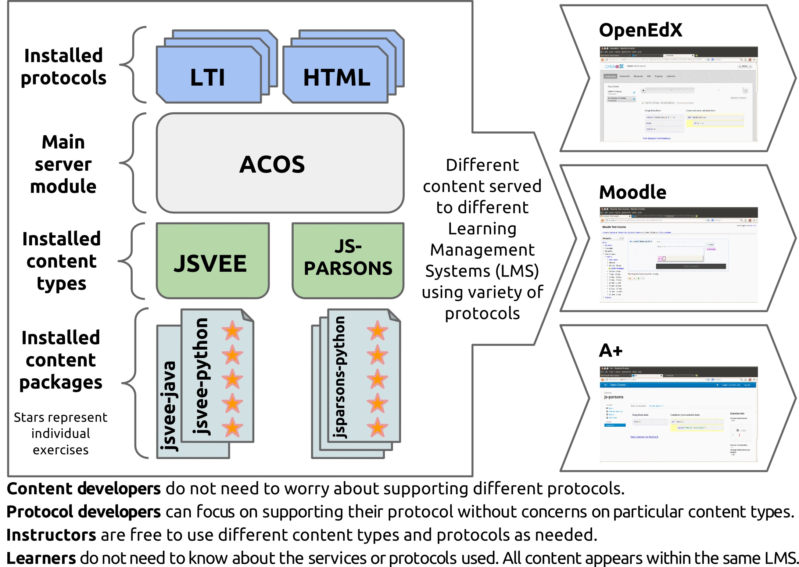

# Acos - Advanced Content Server

Acos server and related sub-projects are a method of distributing browser-based
smart learning content in a reusable and interoperable way. The core idea is
that different types of smart learning content can be hosted in Acos and
offered to various Learning Management Systems (LMS) using different protocols.


## Installation

To install Acos server, clone the repository and install necessary dependencies
by running `npm install` in the acos-server directory.  

For the time being, to install content types and packages use github notation
with npm. E.g.:

  ```
# For JSVEE content type
npm install github:acos-server/acos-jsvee
# For JSVEE Python content
npm install github:acos-server/acos-jsvee-python
  ```

## Running

To run the server use `node bin/www`.

## Key Concepts



For content developers, Acos offers an easy way to add new content without the
need to delve into details of various protocols used to transmit learning
content.

For educators, Acos offers a repository of ready-made content that can easily
be incorporated into an existing course. With certain content types,
customization is also possible.


### Content Type

Content type is an Acos package that defines a type of smart learning content.
It does not contain any actual learning activities or exercises but rather
the libraries and other code needed for those activities. Activities are defined
in Content Packages.

### Content Package

Content packages defined concrete learning activities of a particular content
type. It always depends on the parent content type package to function.
Different sets of activities of a particular type are packaged into content
packages, e.g. packages for program visualizations (acos-jsvee-) exists for
various programming languages.

### Protocol

Different learning management systems use various protocols to transfer
smart learning content and associated metadata such as points a learner has
achieved. An example of such a protocol is  [Learning Tools Interoperability](https://www.imsglobal.org/activity/learning-tools-interoperability).

Content within Acos can be utilized by various supported protocols. These link
external protocols, used with LMSs, to Acos content packages and types.
Content types are implemented in a protocol-agnostic manner, so after a content
type is implemented as an Acos-package it can be utilized by all supported
protocols.

### Tools

Acos also has the concept of a tool where various utility packages can be
installed. As an example, Python code can be submitted to  [acos-python-parser](https://github.com/acos-server/acos-python-parser) in order
to receive concepts used in the code which are parsed from AST.

## Development

Please see [doc/development.md](doc/development.md).

## Related Repositories

### Acos Protocols:
  * [acos-aplus](https://github.com/acos-server/acos-aplus) Support for [A+](github.com/Aalto-LeTech/a-plus) -protocol
  * [acos-html](https://github.com/acos-server/acos-html) Displaying learning
  activities within an iframe without any communication with a LMS
  * [acos-lti](https://github.com/acos-server/acos-lti) Support for LTI-protocol
  * [acos-pitt](https://github.com/acos-server/acos-pitt) Protocol to
  communicate with the University of Pittsburgh

### Acos Content Types:
  * [acos-jsvee](https://github.com/acos-server/acos-jsvee) Content type for
  JSVEE program visualizations
  * [acos-annotated](https://github.com/acos-server/acos-annotated) Content type
  for annotated code examples
  * [acos-jsparsons](https://github.com/acos-server/acos-jsvee) Content type for
  js-parsons code construction problems

### Acos Content Packages:
  * [acos-jsvee-python](https://github.com/acos-server/acos-jsvee-python) Python
  code visualization content
  * [acos-jsvee-java](https://github.com/acos-server/acos-jsvee-java) Java code
  visualization content
  * [acos-jsparsons-python](https://github.com/acos-server/acos-jsparsons-python)
  Python code construction content
  * [acos-jsparsons-python-custom](https://github.com/acos-server/acos-jsparsons-python-custom) Content package that enables creating js-parsons Python content that
  that is defined as an external JSON-file.

### Acos Tool Packages
  * [acos-jsparsons-generator](https://github.com/acos-server/acos-jsparsons-generator) Tool to generate js-parsons exercises as JSON-file, used with [acos-jsparsons-python-custom](https://github.com/acos-server/acos-jsparsons-python-custom)
  * [acos-python-parser](https://github.com/acos-server/acos-python-parser) Tool to parse Python code
 into a concept tree.
  * [acos-logging-keygenerator](https://github.com/acos-server/acos-logging-keygenerator) Tool to create keypairs for logging
